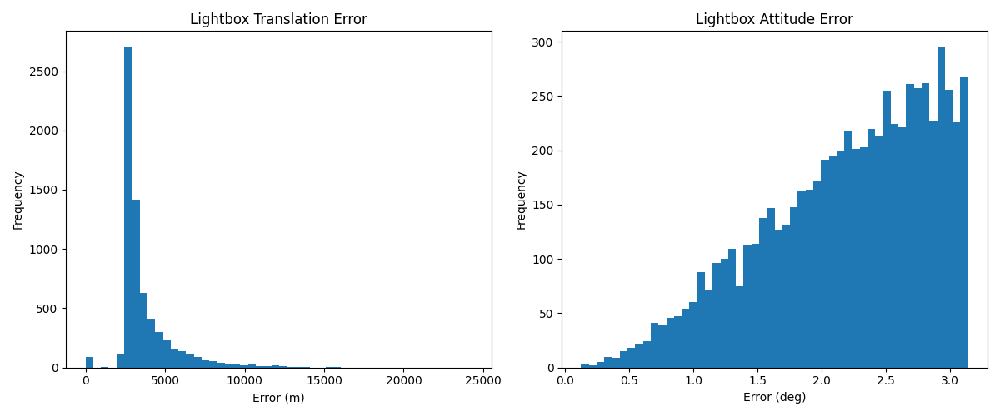
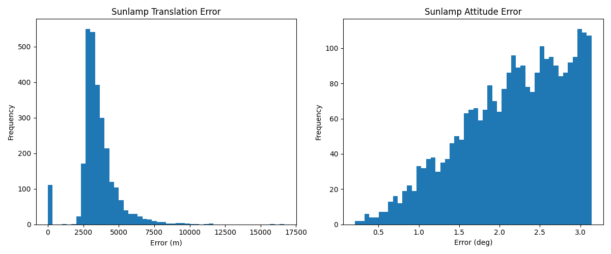

# Spacecraft Pose Estimation from Monocular Images

This project implements and evaluates a Keypoint Regression Network (KRN) for estimating the 6-DOF (Degrees of Freedom) pose of a spacecraft from a single monocular image. The model is trained on a synthetic dataset and evaluated on the SPEED+ dataset, which includes images with different lighting conditions ('lightbox' and 'sunlamp').

## Acknowledgements

This project is built upon the work of Tae Ha "Jeff" Park and his `speedplusbaseline` repository. The original repository can be found here: [https://github.com/tpark94/speedplusbaseline](https://github.com/tpark94/speedplusbaseline)

## Project Structure

```
/home/dex/Open CV project/
├── project/
│   ├── analysis/
│   │   ├── analyze_performance.py
│   │   ├── visualize_results.py
│   │   ├── plots/
│   │   │   ├── lightbox_error_histograms.png
│   │   │   └── sunlamp_error_histograms.png
│   │   └── results.json
│   └── visualize_pose.py
└── speedplusbaseline/
    ├── ... (original repository files)
```

*   **`project/analysis/`**: Contains the scripts and results for the quantitative analysis of the model.
    *   `analyze_performance.py`: Script to calculate the translation and attitude errors.
    *   `visualize_results.py`: Script to generate summary statistics and histograms of the errors.
    *   `plots/`: Directory containing the generated histograms.
    *   `results.json`: The raw error data for each image in the test sets.
*   **`project/visualize_pose.py`**: A script to visualize the predicted pose of the spacecraft on the test images.
*   **`speedplusbaseline/`**: The original `speedplusbaseline` repository, containing the model definition, training scripts, and other necessary files.

## Quantitative Analysis

The model's performance was evaluated on the `lightbox` and `sunlamp` test sets from the SPEED+ dataset. The attitude error was calculated as the angular difference between the predicted and ground truth quaternions.

### **Attitude Error (degrees)**

| Dataset  | Mean | Median | Std Dev |
| :------- | :--- | :----- | :------ |
| Lightbox | 2.20 | 2.30   | 0.66    |
| Sunlamp  | 2.18 | 2.26   | 0.65    |

### **Error Distribution**

**Lightbox Attitude Error:**



**Sunlamp Attitude Error:**



## How to Run

1.  **Clone the repository:**

    ```bash
    git clone <your-repository-url>
    cd <your-repository-name>
    ```

2.  **Install dependencies:**

    ```bash
    pip install -r speedplusbaseline/requirements.txt
    ```

3.  **Run the pose visualizer:**

    ```bash
    python project/visualize_pose.py
    ```

4.  **Run the performance analysis:**

    ```bash
    python project/analysis/analyze_performance.py
    python project/analysis/visualize_results.py
    ```
